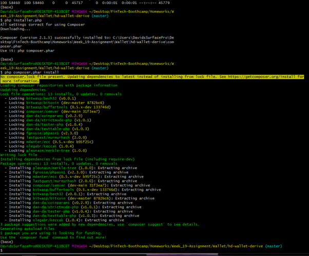
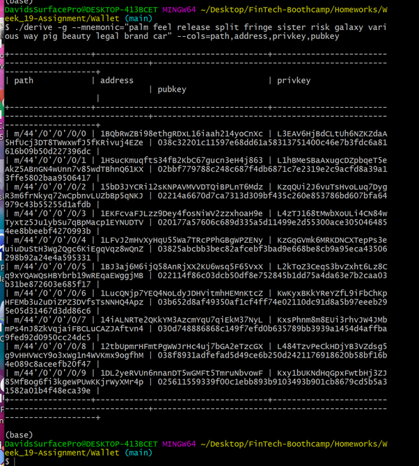
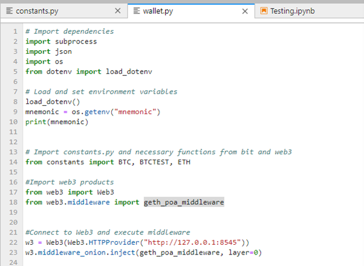
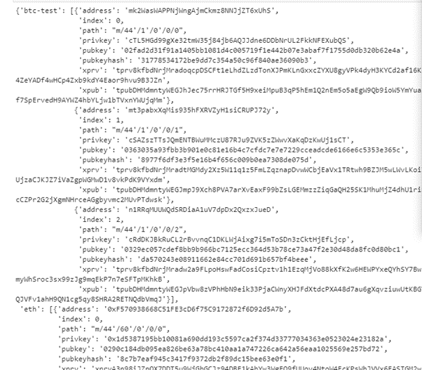
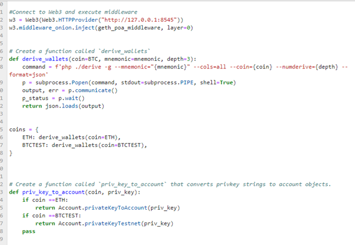
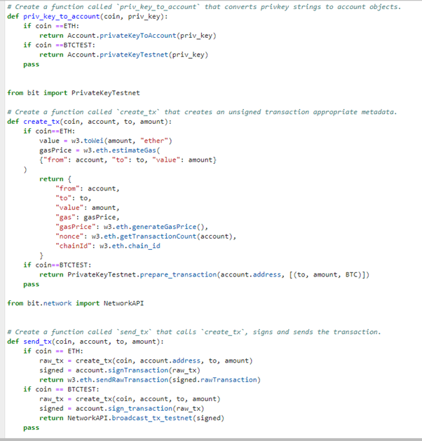
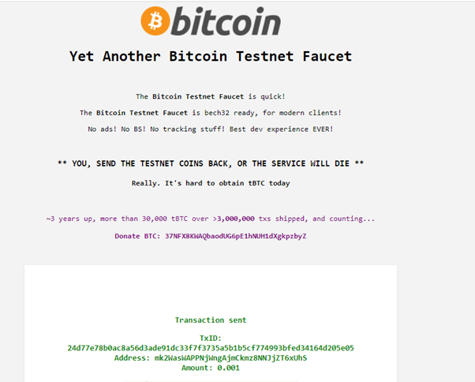
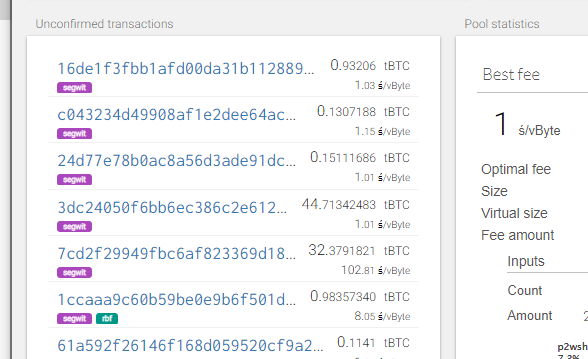

# Week_19-Assignment

# Creating a Mulit-BlockChain Wallet in Python

## Background 

The wallet, built using hd-wallet-derive that securely stores multiple crypto coins, was created here using Etheruem and BTCTEST  but additional coins can be added with ease.

The addresses and private keys for the wallet are bip32 standard and derived from hd-wallet-derive, a command line tool.

Other requirements for development of the wallet are PHP, the open source script langauge, Python libraries for both Ethereum and BTC to create the relevant keys for each coin.

* Etheruem - [ bit ](https://ofek.github.io/bit/)

* BTC - [ web3.py ](https://github.com/ethereum/web3.py)

## Building the model

A folder called Wallet has been created in the Assignment Folder in which the relevant python and working files are contained. In addition there is a test Notebook in which the code for the Master file Wallet.py was tetsed.

hd-wallet-derived was cloned into the wallet folder and php installed

* git clone https://github.com/dan-da/hd-wallet-derive
* cd hd-wallet-derive/
* curl https://getcomposer.org/installer -o installer.php
* php installer.php

In GitBash as an administrator, in Wallet folder,  Wallet, HP_Wallet-derive was firstly then  linked created to allow the code to run as -derive. (Images 1 and 2)

## Wallet.py

Construction of the universal Wallet script utilised the subprocess module to run new applications through the code, 
the OS module, a "hidden" .env file containing the secret pnemonic code, bit and web3 to create relevant crypto keys.
In addition, Web3 Middleware code for POA purchases.

The personal pnemonic code was created in hd-wallet-derive and contained in the dotenv file (.env).

Coins to be purchased, in this case BTC, EThereum and BTCTEST are contained within the python file constants.py

Json was installed and used to format the generated keys 

## Dering Keys in the model

A file derive wallets was created using ./derive ("shortcut" created previously), using the input mnemonic code, and 3 coins.
In json format Ethereum and BTCTEST wallets containing address, private and public keys (Image 4)

Account for the 2 coins are created from Private keys.
Using create_tx function a crypto transaction is created for BTC suing Bit and Ethereum using Web3. Output parameters include
* from and to accounts
* transaction amount
* type of coin
* gas price for Ethereum  

The final step is to create the raw transaction using send_tx which works in combination with create_tx with the same coin, account, to and from parameters
The transaction is signed and sent/broadcast to the appropriate API.(Images 5 and 6).

## Transactions

Running the code from wallet import *, in a Command window in Wallet allows to send transaction using prive_key_to_account

### Bitcoin Testnet
An amount of 0.001 BTC was successfully funded into BTCTEST using the new wallet and testnet faucet https://testnet-faucet.mempool.co/ (image 7) and confirmed in BTC bitaops https://tbtc.bitaps.com/ (image 8)

